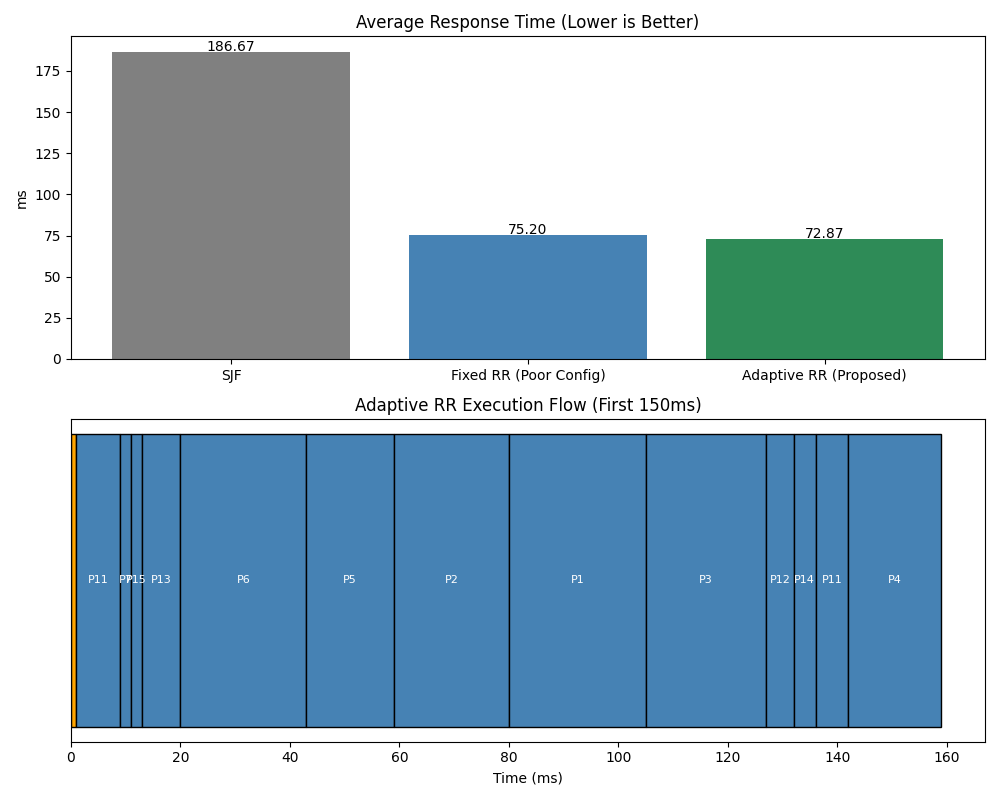

# Adaptive Time-Slice Round Robin via CPU-Burst Prediction

> **CSCI 6650 - Operating Systems Term Project**  
> Author: Yuze Gao (2119104)

## Overview

This project implements and compares three CPU scheduling algorithms on an identical mixed workload (CPU-bound + I/O-bound processes):

| Algorithm | Description |
|-----------|-------------|
| **SJF** | Shortest Job First (non-preemptive) - Theoretical optimal baseline |
| **Fixed RR** | Round Robin with static time quantum |
| **Adaptive RR** | *Our proposed method* - Dynamic quantum using EMA prediction |

## Key Innovation

Traditional Round Robin uses a fixed time quantum that cannot adapt to different task types. Our **Adaptive RR** uses Exponential Moving Average (EMA) to predict each process's next CPU burst length, then dynamically adjusts the time quantum:

```
prediction_new = α × actual_last_burst + (1 - α) × prediction_old
time_quantum = clamp(round(prediction), min_q, max_q)
```

**Why this works:**
- **I/O-bound processes**: Short historical bursts → low prediction → small quantum → complete quickly
- **CPU-bound processes**: Long historical bursts → high prediction → larger quantum → fewer context switches

## Metrics Collected
- **Response Time** - First run time minus arrival time
- **Waiting Time** - Total time spent in ready queue
- **Turnaround Time** - Finish time minus arrival time
- **Context Switches** - Number of preemptions per process

## Project Structure
```
├── src/
│   ├── os_simulation.py              # Main simulation script
│   ├── os_simulation_annotated.py    # Chinese annotated version
│   └── os_simulation_annotated_en.py # English annotated version (for presentation)
├── figures/
│   └── response_time_comparison.png  # Sample output chart
├── PPT/
│   └── Adaptive_Time_Slice_Round_Robin_YUZE_GAO_2119104.pptx
├── requirements.txt
└── README.md
```

## Quick Start

```bash
# Clone the repository
git clone https://github.com/BenjaminGao2025/OS-project.git
cd OS-project

# Create virtual environment (optional but recommended)
python -m venv .venv
source .venv/bin/activate  # macOS/Linux

# Install dependencies
pip install -r requirements.txt

# Run simulation
python src/os_simulation.py
```

## Configuration

Edit parameters in `src/os_simulation.py`:

| Parameter | Description | Default |
|-----------|-------------|---------|
| `num_processes` | Total number of processes | 15 |
| `cpu_bound_ratio` | Fraction of CPU-bound processes | 0.4 |
| `fixed_quantum` | Time quantum for Fixed RR (ms) | 60 |
| `alpha` | EMA smoothing factor (0-1) | 0.5 |
| `min_q`, `max_q` | Quantum bounds for Adaptive RR | 5, 25 |
| `seed` | Random seed for reproducibility | 999 |

## Sample Output

The simulation prints per-process metrics and generates visualizations:



## Files

| File | Description |
|------|-------------|
| `src/os_simulation.py` | Main simulation code |
| `src/os_simulation_annotated_en.py` | Fully commented version for presentation |
| `PPT/*.pptx` | Presentation slides |
| `*.docx`, `*.doc` | Project reports |

## License

Educational use for CSCI 6650 Operating Systems course.

