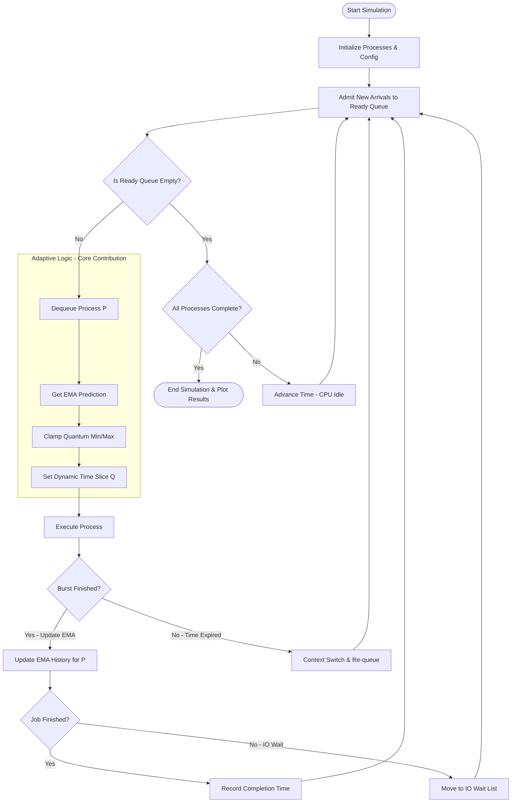
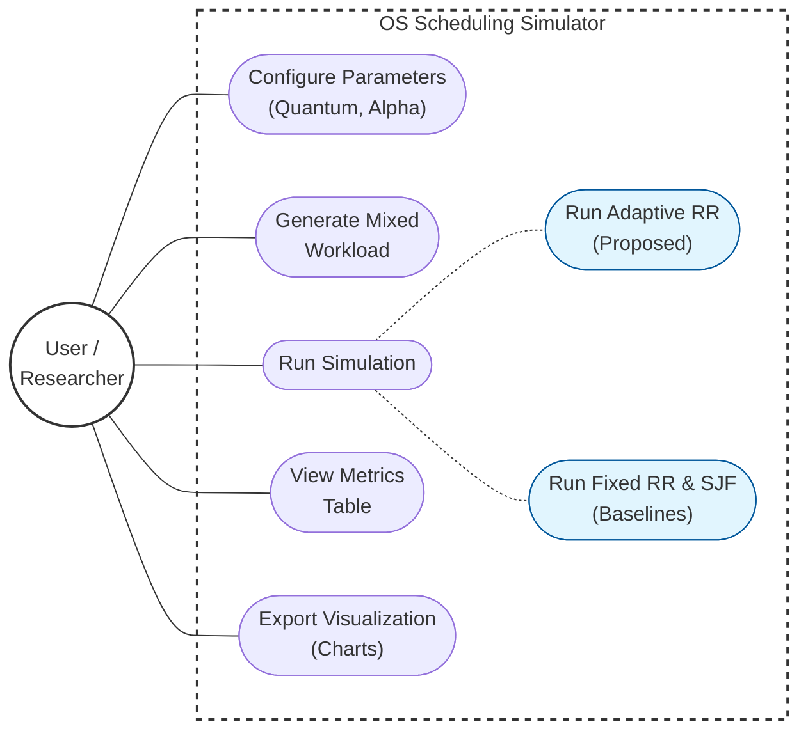

```mermaid
flowchart TD
    Start([Start Simulation]) --> Init[Initialize Processes & Config]
    Init --> CheckArrivals[Admit New Arrivals to Ready Queue]
    CheckArrivals --> IsQueueEmpty{Is Ready Queue Empty?}
    
    IsQueueEmpty -- Yes --> AllDone{All Processes Complete?}
    AllDone -- Yes --> Stop([End Simulation & Plot Results])
    AllDone -- No --> Idle[Advance Time - CPU Idle]
    Idle --> CheckArrivals
    
    IsQueueEmpty -- No --> Dequeue[Dequeue Process P]
    
    subgraph AdaptiveLogic [Adaptive Logic - Core Contribution]
        Dequeue --> Predict[Get EMA Prediction]
        Predict --> Clamp[Clamp Quantum Min/Max]
        Clamp --> SetQ[Set Dynamic Time Slice Q]
    end
    
    SetQ --> RunCPU[Execute Process]
    RunCPU --> CheckFinish{Burst Finished?}
    
    CheckFinish -- Yes - Update EMA --> UpdateEMA[Update EMA History for P]
    UpdateEMA --> CheckJobDone{Job Finished?}
    CheckJobDone -- Yes --> RecordMetrics[Record Completion Time]
    CheckJobDone -- No - IO Wait --> MoveToIO[Move to IO Wait List]
    RecordMetrics --> CheckArrivals
    MoveToIO --> CheckArrivals
    
    CheckFinish -- No - Time Expired --> ContextSwitch[Context Switch & Re-queue]
    ContextSwitch --> CheckArrivals
```

```mermaid
graph LR
    %% 定义角色 (用圆形代表 User)
    User(("User /
    Researcher"))
    
    %% 定义系统边界 (用子图代表 System Boundary)
    subgraph System ["OS Scheduling Simulator"]
        direction TB
        %% 定义用例 (用椭圆代表 Use Cases)
        UC1(["Configure Parameters
        (Quantum, Alpha)"])
        UC2(["Generate Mixed
        Workload"])
        UC3(["Run Simulation"])
        UC3a(["Run Adaptive RR
        (Proposed)"])
        UC3b(["Run Fixed RR & SJF
        (Baselines)"])
        UC4(["View Metrics
        Table"])
        UC5(["Export Visualization
        (Charts)"])
    end
    
    %% 连接线
    User --- UC1
    User --- UC2
    User --- UC3
    User --- UC4
    User --- UC5
    
    %% Include 关系 (虚线)
    UC3 -.- UC3a
    UC3 -.- UC3b
    
    %% 样式调整 (让它看起来更像 UML)
    style User fill:#fff,stroke:#333,stroke-width:2px
    style System fill:#fff,stroke:#333,stroke-width:2px,stroke-dasharray: 5 5
    style UC3a fill:#e1f5fe,stroke:#01579b
    style UC3b fill:#e1f5fe,stroke:#01579b
```